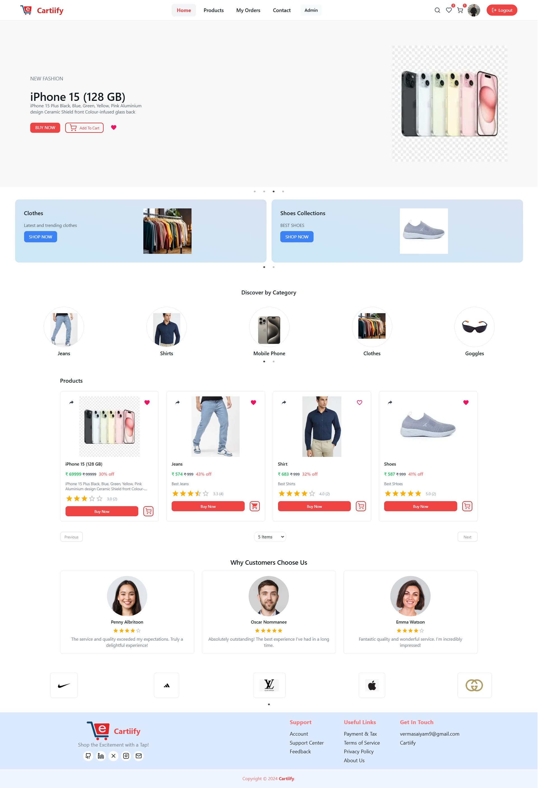

# Cartify - E Commerce Website 

An advanced e-commerce platform built with **Next.js**, offering a modern user interface, seamless user experience, and comprehensive functionality for both customers and administrators.

---

## About Me

Hi! My name is Saiyam Verma. I am a passionate **Full Stack Developer** specializing in the **MERN stack** and continuously exploring new technologies like **Next.js** to build innovative applications.

---

## Installation Guide

### Step 1: Clone the Repository

```bash
git clone https://github.com/Vermasaiyam/Cartiify.git
cd Cartiify
```

### Step 2: Install Dependencies

```bash
npm install
```

### Step 3: Environment Variables

Create a `.env.local` file in the root directory and add the following variables:
```bash
NEXT_PUBLIC_FIREBASE_API_KEY=
NEXT_PUBLIC_FIREBASE_AUTH_DOMAIN=
NEXT_PUBLIC_FIREBASE_PROJECT_ID=
NEXT_PUBLIC_FIREBASE_STORAGE_BUCKET=
NEXT_PUBLIC_FIREBASE_MESSAGING_SENDER_ID=
NEXT_PUBLIC_FIREBASE_APP_ID=
NEXT_PUBLIC_FIREBASE_MEASUREMENT_ID=
NEXT_PUBLIC_CLOUDINARY_CLOUD_NAME=
NEXT_PUBLIC_CLOUDINARY_API_KEY=
NEXT_PUBLIC_CLOUDINARY_API_SECRET=
NEXT_PUBLIC_DOMAIN=
NEXT_PUBLIC_FIREBASE_SERVICE_ACCOUNT_KEYS=
```

### Step 4: Run the development server

```bash
npm run dev
# or
yarn dev
# or
pnpm dev
# or
bun dev
```

## Cartiify Features

### 1. Login & Signup

- **Standard Authentication**:  
  Login and signup using email and password.

- **Google Authentication**:  
  Login with Google for a seamless experience.
  
### 2. HomePage

A modern homepage showcasing featured products, trending categories, brands, and new arrivals.


